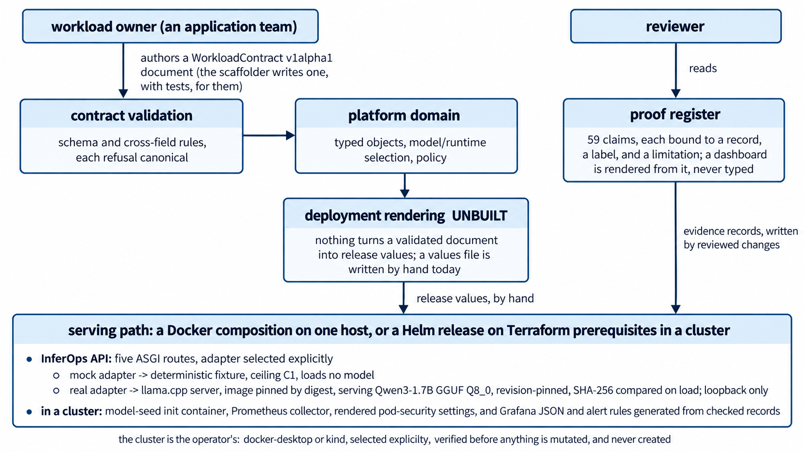

# InferOps

**A production-oriented reference architecture for serving large language
models on Kubernetes, built so that every capability it names resolves to an
executed record.**

InferOps takes a workload contract an application team writes, validates it,
scaffolds a workload from it, and serves real LLM completions behind one API,
first on a contributor's own machine and then inside a Kubernetes cluster the
operator already owns, with a Helm release, a Terraform prerequisite layer, a
release-scoped Prometheus collector, a checked dashboard, and a set of alerts.
The serving runtime is a digest-pinned `llama.cpp` server and the model is a
revision- and hash-pinned Qwen3-1.7B GGUF, so a run can prove what it ran.

V1 serves real inference. It has been measured, not just deployed: the same
release has been put under declared load, had its serving pod deleted mid-flight,
been held with a model that never became ready, and had its measured use costed
under a published method. Each result is one bounded observation on one host, and
each is published beside the limitation that travels with it.

## What V1 proves

The strongest evidence, one row per capability. Every row is one execution on
Docker Desktop's Kubernetes (`docker-desktop`), on one Windows host, on CPU, with
one replica of each tier, unless it says otherwise. Every figure is that run's
observation and no figure is a capacity, an SLO, or a benchmark.

| Capability | Evidence | What was observed | Record |
|---|---|---|---|
| Real LLM serving through the InferOps API, locally | local real, `C2` | First certified on 2026-09-04; in the clean-clone run the pinned runtime became ready in 183 015 ms and one completion returned `HTTP 200` in 3 641 ms with 43 tokens, real identity asserted | [C2 certification](docs/proof/serving/v1-s2-004-c2-certification-result.md), repeated in [the clean-clone run](docs/proof/environment/v1-s5-001-pr2-clean-clone-run.md) |
| Real LLM serving inside a Kubernetes cluster | local real, `C2` | Terraform prerequisites applied, Helm release installed, the model hash compared in the cluster, and a real completion served through the release's own Service; in the clean-clone run that completion returned `HTTP 200` in 2 500 ms | [Docker Desktop paved road](docs/proof/environment/v1-s3-011-pr1-docker-desktop-paved-road.md), repeated in [the clean-clone run](docs/proof/environment/v1-s5-001-pr2-clean-clone-run.md) |
| The whole journey from a clean clone | local real, `C2` | All 18 checklist steps completed from a fresh clone in 1 h 30 min 32 s of wall clock, across three invocations; cleanup left the operator's cluster with every namespace it had before | [Clean-clone run](docs/proof/environment/v1-s5-001-pr2-clean-clone-run.md) |
| Operations dashboard against a real collector | local real, `C2` | A real Prometheus evaluated all 30 panel expressions in nine controlled states and refused none; Grafana rendered all 29 panels; request, error, and token counts reconciled exactly with what clients sent | [Dashboard validation](docs/proof/telemetry/v1-s4-002-pr2-dashboard-validation.md) |
| Declared load and a degradation point | local real, `C2` | Two repetitions of a versioned profile, 366 requests, every one `HTTP 200`; completed requests stayed flat from concurrency 1 to 4 while latency rose, so that setup's observed degradation point is concurrency 2 | [Performance findings](docs/proof/serving/v1-s4-004-pr2-performance-findings.md) |
| Losing the serving pod under load | local real, `C2` | The replacement reported Ready 33 665 ms after the delete; callers saw a 31 960 ms outage in which 40 of the 41 requests dispatched were refused; the workflow issued no mutating command between the delete and its closing uninstall | [Pod recovery](docs/proof/serving/v1-s4-006-pr1-inference-pod-recovery.md) |
| A model that does not become ready | local real, `C2` | A starved runtime bound its port and never finished loading; it was held there 179 755 ms while four request surfaces were asked and readiness was sampled from four places, then recovered by an upgrade | [Unready model recovery](docs/proof/serving/v1-s4-007-pr1-unready-model-recovery.md) |
| Cost of the measured use | estimated, confidence `none` | The published method applied to processor and memory use taken from the load run's samples, priced at a synthetic rate card; the arithmetic is checkable and no cost figure is published | [Cost baseline](docs/proof/cost/v1-s4-005-pr2-cost-baseline.md) |
| Alerts over recorded telemetry | local static and synthetic | Five of the six alerts replayed over the telemetry three real experiments recorded: one fires, over one capture, and every silence has a recorded reason; nothing routes or delivers an alert to anybody | [Alert validation](docs/proof/telemetry/v1-s4-008-pr1-alert-validation.md) |

The full picture is [the V1 proof dashboard](docs/proof/dashboard.md): 59 claims,
41 certified, 7 planned, 1 deferred, and 10 that V1 states it does not have, each
with every evidence record behind it — at its own level, with where it ran and what
it substituted — and the limitation that travels with the claim. It opens with
one row per capability and a five-minute reading order, and every row above is
there under its capability with the claim that cites its record. It is generated
from [the claim and evidence register](docs/testing/claim-evidence-matrix.md), and a
test refuses a page that disagrees with the register or a count in this paragraph
that disagrees with either. The Grafana screenshots in the dashboard record are
operations evidence, what a running release showed; the proof dashboard is the
index of what has and has not been proven.

> [!IMPORTANT]
> **What V1 is not.** Every real result above is one provider, one Windows host,
> CPU only, and one replica of each tier; the multi-replica profile was refused at
> a capacity gate on that host. No caller is authenticated or authorized, nothing
> is rate-limited, nothing is exposed beyond loopback, and the network policy the
> chart renders is not enforced by the clusters this project runs on. No versioned
> release exists. No second engineer has repeated the clean-clone journey. InferOps
> is not a production-ready, portable platform anyone can deploy for someone else,
> and no record here says it is.

## Five minutes, in order

1. **The problem and the answer.** Serving an LLM is easy to demo and hard to
   state honestly. InferOps's answer is a paved road: a workload contract, one API
   with an explicit mock or real adapter, a chart and prerequisite layer for a
   cluster the operator owns, telemetry that says when it is not there, and a
   register that binds every public claim to a record.
   [The architecture](#architecture) is the next section.
2. **Run the safe path.** [The mock quick start](#quick-start-the-safe-mock-path)
   needs Git, `uv`, and CPython 3.12, and proves the contract and the API, never a
   model.
3. **Read what a real run looks like.** [The real local path](#quick-start-the-real-local-path)
   and [the Kubernetes path](#the-kubernetes-path) are authorization-gated and are
   shown with the figures the executed records carry.
4. **Check the proof.** [The results](#results) link the dashboard, load, failure,
   and cost records; [the proof dashboard](docs/proof/dashboard.md) indexes the
   rest.
5. **Read the limits.** [The security boundary](#security-boundary),
   [the limitations](#limitations), and [what comes next](#roadmap) say what V1
   does not have, in that order, before any claim about a next version.

## Architecture

[](docs/architecture/inferops-v1-architecture.png)

*Select the diagram to view it at full size. Deployment rendering is unbuilt; release values are written by hand.*

<details>
<summary>View the text architecture diagram</summary>

```text
  workload owner (an application team)                      reviewer
       |                                                        |
       | authors a WorkloadContract v1alpha1 document           | reads
       | (the scaffolder writes one, with tests, for them)      |
       v                                                        v
  +--------------------+   +------------------+   +-------------------------+
  | contract           |-->| platform domain  |   | proof register          |
  | validation         |   | typed objects,   |   | 59 claims, each bound   |
  | schema and cross-  |   | model/runtime    |   | to a record, a label,   |
  | field rules, each  |   | selection, policy|   | and a limitation;       |
  | refusal canonical  |   +--------+---------+   | a dashboard is rendered |
  +--------------------+            |             | from it, never typed    |
                                    v             +------------^------------+
                   +----------------+---------------+          |
                   | deployment rendering   UNBUILT |          | evidence
                   | nothing turns a validated      |          | records,
                   | document into release values;  |          | written by
                   | a values file is written by    |          | reviewed
                   | hand today                     |          | changes
                   +----------------+---------------+          |
                                    | release values, by hand  |
                                    v                          |
  +-------------------------------------------------------------+-----------+
  | serving path: a Docker composition on one host, or a Helm release on    |
  | Terraform prerequisites in a cluster                                    |
  |                                                                         |
  |   InferOps API: five ASGI routes, adapter selected explicitly           |
  |     mock adapter -> deterministic fixture, ceiling C1, loads no model   |
  |     real adapter -> llama.cpp server, image pinned by digest, serving   |
  |                     Qwen3-1.7B GGUF Q8_0, revision-pinned, SHA-256      |
  |                     compared on load; loopback only                     |
  |   in a cluster: model-seed init container, Prometheus collector,        |
  |     rendered pod-security settings, and Grafana JSON and alert rules    |
  |     generated from checked records                                      |
  +-------------------------------------------------------------------------+
      the cluster is the operator's: docker-desktop or kind, selected
      explicitly, verified before anything is mutated, and never created
```

</details>

Three decisions shape it:

- **The cluster is the operator's.** InferOps selects an existing `kind` or Docker
  Desktop cluster explicitly, verifies it before mutating anything, and creates or
  deletes none ([ADR 0011](docs/architecture/decisions/ADR-0011-external-local-cluster-provider-contract.md)).
- **A mock may never certify real behaviour.** The adapter is chosen by name, the
  mock declares itself, and there is no fallback from real to mock
  ([the boundary](docs/serving/mock-and-real-boundary.md)).
- **A claim is published only with its evidence and its limitation.** Every evidence
  record carries its own level, `C0` Static to `C4` Operational, which says how that
  record was obtained and nothing more; a claim's status is a separate question, and
  a validator holds each record to what its level requires
  ([InferOps Evidence Levels](docs/testing/evidence-levels.md)). **The levels are
  project-defined and not an ISO, NIST, regulatory, or industry certification
  standard.** No V1 record is above `C2`.

The design boundary, the request and deployment flows, the trust boundaries, and
what is not defended at each are in
[the system architecture](docs/architecture/system-architecture.md). The fourteen
decision records are indexed in [the architecture index](docs/architecture/README.md).
One component of the design is still unbuilt: nothing turns a validated contract
into release values, and a values file is written by hand.

## Prerequisites

| Path | Needs | Where it is measured |
|---|---|---|
| Mock | Git, `uv`, CPython 3.12, and a repository checkout. No network beyond the package index, no engine, no model | [Developer quick start](docs/developer-quick-start.md) |
| Real local | A container engine, an AVX2 CPU, the memory and disk the local-environment tier states, a 1.71 GiB model download, the pinned runtime image, and the host owner's explicit consent to each | [Supported-host prerequisites](docs/prerequisites.md), [ADR 0001](docs/architecture/decisions/ADR-0001-local-development-environment.md), [ADR 0002](docs/architecture/decisions/ADR-0002-model-and-serving-runtime.md) |
| Kubernetes | Everything above, plus an existing `docker-desktop` or `kind` cluster, a `kubectl` within one minor version of its server, Helm, and Terraform. The executed run used Kubernetes `v1.34.3`, Helm `v3.19.0`, and Terraform `1.15.8` | [Provider contract](docs/environment/local-cluster-provider-contract.md), [the clean-clone run's environment](docs/proof/environment/v1-s5-001-pr2-clean-clone-run.md#environment) |

The executed records were produced on Windows 11 with Docker Desktop's Kubernetes.
Linux and macOS are intended and the scripts have not been run on either.

## Quick start: the safe mock path

Evidence this path produces: `local-static` for the contract, `mock` for the API.
It establishes contract conformance and the consumer side of the API, and it can
establish nothing about a model, latency, throughput, or tokens. Run every command
from the repository root, in a POSIX shell (Git Bash on Windows).

```sh
uv sync --locked
uv run --locked python -m tools.workload_scaffold \
  --name quickstart-mock \
  --owner team-platform \
  --environment ci \
  --profile mock-llm \
  --runtime-profile resource-conscious \
  --cpu 250m \
  --memory 128Mi \
  --tenant demo \
  --cost-center demo-cost-center \
  --data-classification public \
  --description "Deterministic quick-start contract test; never real-runtime evidence." \
  --into .quickstart
uv run --locked python -m tools.contract_validation \
  .quickstart/quickstart-mock/workload.yaml
uv run --locked python -m pytest .quickstart/quickstart-mock/tests -q
uv run --locked python -m pytest tests/api/test_api_end_to_end_mock.py -q
```

The recorded results were `ok generated`, `ok`, `7 passed`, and `31 passed`. The
last suite selects the `mock` adapter by name, calls all five routes in process,
and gets back the committed fixture with `_inferops.adapterKind: "mock"` and
`usage: null`, because the mock measured no tokens. The clean-clone workflow's
`workload-scaffold` step runs the same scaffold and validation.
[The developer quick start](docs/developer-quick-start.md) has the real-profile
scaffold, the troubleshooting table, and the cleanup that removes only what it
generated.

## Quick start: the real local path

Evidence this path produces: `local-real-cpu`, ceiling `C2`, only after a
completed, recorded run. Stop unless the host owner has authorized a 1.71 GiB
model download, an image pull, and a runtime process on this host. Each command
that touches the network, the engine, or the model asks for that consent
explicitly, and none falls back to a mock.

```sh
uv run --locked python -m tools.model_acquisition check
uv run --locked python -m tools.model_acquisition acquire
uv run --locked python -m tools.model_acquisition verify
uv run --locked python -m tools.runtime_packaging check
uv run --locked python -m tools.runtime_certification certify --confirm-real-runtime
```

`acquire` downloads the pinned revision resumably and refuses to promote bytes
whose SHA-256 does not match the published hash; the executed clean-clone run
needed three invocations because the transfer stopped twice, and each resumed by
byte range. `runtime_packaging check` prints the runtime image digest to pull
with Docker before the last command, which performs no implicit pull. `certify`
starts the pinned runtime against the verified model, waits for readiness within
a 300 000 ms budget, starts the real-adapter API, sends one completion, asserts
the real identity, and tears both down. In
[the clean-clone run](docs/proof/environment/v1-s5-001-pr2-clean-clone-run.md)
the runtime was ready in 183 015 ms and the completion returned in 3 641 ms with
43 tokens; an earlier host measurement came within five per cent of the readiness
budget, so a run on a slower host can fail there and need a retry.

The workflow, its refusals, and the record it writes are in
[real-runtime certification](docs/serving/real-runtime-certification.md);
[model acquisition](docs/serving/model-acquisition.md) and
[the runtime package](docs/serving/local-runtime-package.md) own the two
prerequisites.

## The Kubernetes path

The verified way to reach real Kubernetes inference is the clean-clone workflow,
which runs the whole journey in the order the checklist states and keeps a ledger
of every step's outcome, exit code, and elapsed time. This is the command the
executed record carries, from a fresh clone, in Git Bash, with
`INFEROPS_DISK_VOLUME` set only if the engine's storage is not on the system
drive:

```sh
INFEROPS_PROVIDER=docker-desktop scripts/environment/clean-clone.sh run \
  --confirm-downloads --confirm-real-runtime --confirm-real-kubernetes \
  --confirm-cleanup
```

The provider is selected explicitly and there is no default. Every forward-path
consent is required on every invocation, including a resume; a step that fails is
where the next invocation starts. Cleanup uninstalls only a release the run left,
destroys only the Terraform prerequisites it applied, and then checks that the
cluster, its node, and every namespace present before the run are still there.

The [executed run](docs/proof/environment/v1-s5-001-pr2-clean-clone-run.md)
completed all 18 steps: prerequisites, the locked toolchain, two of the
continuous-integration lane's gates, scaffolding, model acquisition, the runtime
image, local real inference, provider verification, the release images, Terraform,
Helm install and upgrade and rollback, Kubernetes inference, telemetry, load, the
pod-loss experiment, cleanup, and the survival check. Wall clock was
1 h 30 min 32 s across three invocations, and the model download accounts for the
two retries. `scripts/environment/clean-clone.sh plan` prints the checklist and
`run --prepare-only` runs every step that needs no consent.

Each step is also a workflow of its own, for a reviewer who wants one piece:
[provider verification](docs/environment/local-cluster-provider-contract.md),
[Helm release lifecycle](docs/environment/helm-release-lifecycle.md),
[Kubernetes real-inference certification](docs/serving/kubernetes-real-inference-certification.md),
and [troubleshooting and cleanup](docs/environment/kubernetes-troubleshooting.md).
The executed step sequence, with the four certification attempts that failed and
what each found, is in
[the Docker Desktop paved road](docs/proof/environment/v1-s3-011-pr1-docker-desktop-paved-road.md).

## Results

What each experiment established, with the label that decides what it may support.
Every real figure is one release of the real profile, one API replica, one runtime
replica with one parallel slot, one fixed prompt, on `docker-desktop`, on one host,
under [ADR 0013](docs/architecture/decisions/ADR-0013-bounded-local-performance-observations.md).

| Area | Label | Established | Not established | Record |
|---|---|---|---|---|
| Dashboard | local real | 29 panels and 30 expressions asked of a real Prometheus in nine states, rendered by a real Grafana; zero and missing come apart on a real collector as the record says | Anything about `kind`, two replicas, another host, or a latency or throughput figure | [V1-S4-002-PR2](docs/proof/telemetry/v1-s4-002-pr2-dashboard-validation.md), [screenshots](docs/proof/telemetry/v1-s4-002-pr2-screenshots/02-traffic.png) |
| Load | local real | Warm-up then 60 requests each at concurrency 1, 2, and 4, twice; 366 of 366 answered `HTTP 200`; observed degradation point at concurrency 2 for that setup | Capacity, saturation, an SLO, a benchmark, or a figure for another prompt, replica count, or host | [V1-S4-004-PR1](docs/proof/serving/v1-s4-004-pr1-validation.md), [findings](docs/proof/serving/v1-s4-004-pr2-performance-findings.md) |
| Pod loss | local real | Replacement Ready 33 665 ms after the delete; 31 960 ms caller-visible outage; 40 of the 41 requests dispatched in it refused; at every readiness sample before the replacement was observed Ready, the deleted pod reported Ready while the Service had no ready endpoint | An availability figure, an error budget, an SLO, or a recovery-time objective | [V1-S4-006-PR1](docs/proof/serving/v1-s4-006-pr1-inference-pod-recovery.md) |
| Unready model | local real | Readiness stayed false for 179 755 ms while the process stayed alive; four request surfaces were asked and each answer is recorded; recovery by dropping the overlay and upgrading | Any recovery-time figure; the artifact-mismatch or healthy-pod cases, which are other records | [V1-S4-007-PR1](docs/proof/serving/v1-s4-007-pr1-unready-model-recovery.md) |
| Cost | estimated | Processor seconds and memory byte-seconds of the request path over each load run, taken from committed samples by a tool, priced at a synthetic rate card, with unallocated node capacity accounted for | A price, a bill, a provider figure, or a figure with confidence above `none`; no cost figure is published | [V1-S4-005-PR2](docs/proof/cost/v1-s4-005-pr2-cost-baseline.md), [method](docs/cost/README.md) |
| Alerts | local static, synthetic | Six alerts with owners, severities, and runbook sections, loaded by the pinned collector's `promtool` and replayed over the telemetry three real experiments recorded | Delivery: no receiver, routing tree, or on-call rotation exists, and no alert reaches anybody | [V1-S4-008-PR1](docs/proof/telemetry/v1-s4-008-pr1-alert-validation.md) |
| Local baseline | local real | 30 measured requests, all successful, every pre-registered threshold met, one host, one day | A benchmark or a figure for any other host or model | [V1-S2-005](docs/proof/serving/v1-s2-005-baseline-raw-results.md) |

## Security boundary

[The V1 security baseline](docs/security/README.md) is accepted in part and
machine-checked, and it is a statement of what is not defended rather than of
what is. Twelve risks are carried rather than reduced, and ten of the twelve
block production use:

- no caller is authenticated and no request is authorized;
- there is no rate limit, quota, or concurrency limit;
- no pod-security property is enforced for a pod this platform deploys, although
  the chart renders the settings;
- the local cluster plugin does not enforce the rendered network policy, which
  [one experiment measured](docs/proof/security/v1-s3-004-pr1-network-policy-enforcement.md);
- no secret manager, rotation policy, or expiry check exists;
- request records are written and nothing keeps them, so nothing can be
  reconstructed afterwards.

Every real run is loopback-only, on one host, started by hand under explicit
consent. The API's redaction rules keep prompts, responses, and secrets out of
metrics and logs by construction, and a real run proving that is still `planned`.
The register is [the deferred-risk list](docs/security/deferred-risks.md), and
[SECURITY.md](SECURITY.md) records that no private reporting channel is published.

## Limitations

- **One provider, one host, CPU.** Every real result is Docker Desktop's
  Kubernetes on one Windows workstation. Nothing certifies `kind`, Linux, macOS, a
  GPU, another model, or another runtime version, and Docker Desktop evidence may
  not be read as evidence for `kind`.
- **One replica.** The multi-replica profile was refused at the capacity gate on
  the measured host and is listed as not claimed.
- **One execution is not a distribution.** Each experiment ran once or twice. The
  clean-clone journey completed once, after two attempts that stopped on defects
  the run itself found and fixed, and no second engineer has repeated it.
- **Bounded observations only.** No figure here is capacity, an SLO, an error
  budget, or a benchmark, and sustained throughput under load is deferred out of
  V1.
- **Estimated cost only.** The only rate card is synthetic, every cost record has
  confidence `none`, and no platform component computes a cost.
- **Not defended.** See [the security boundary](#security-boundary).
- **Deployment rendering is unbuilt.** A validated contract does not yet produce
  release values; the serving-a-described-workload claim is `planned`.
- **No release.** The release process is documented and has not been executed.
- **Continuous integration runs the default lane only.** No lane installs a
  release into a cluster or executes a real model; that is listed as not claimed.
- **Reading is not checking.** The tests hold the register to its references,
  ranks, and vocabulary. Whether a record says what a row citing it says it says
  is a reading, and no test performs one.

## Roadmap

What comes next is stated only where the register already states it, so that no
intention reads as a capability:

- **Planned.** Seven claims V1 intends and nothing has proven, marked
  `planned` in [the register's claim tables](docs/testing/claim-evidence-matrix.md#the-claims): serving a
  workload the contract describes, deriving deployment values only from a validated
  document, the mock path's self-identification, canonical errors for an unready
  model and an unreachable runtime, redaction proven in a real run, and the
  absence of any credential or model artifact from public history.
- **Deferred.** [Sustained throughput and capacity under load](docs/testing/claim-evidence-matrix.md#load-and-performance)
  is out of V1 by an accepted decision.
- **Not claimed.** [Nine things a reader would expect](docs/proof/dashboard.md#what-v1-does-not-claim),
  stated as absent rather than omitted, including a delivered alert, an enforced
  network policy, a defended workload, a cluster lane in CI, a published release,
  portability as a production platform, and an authorisation statement in every
  certifying record — which the evidence migration measured and moved out of the
  certified column.
- **Release.** [The release process](docs/releases.md) names `v1.0.0` as the first
  planned stable release and the checklist it must pass; no tag exists.

## Public entry points

| Topic | Entry point | Current status |
|---|---|---|
| Developer quick start | [docs/developer-quick-start.md](docs/developer-quick-start.md) | Mock workflow executed locally; the real-runtime API smoke is authorization-gated and has been executed and recorded — see [the Sprint 1 real-runtime closure](docs/proof/serving/v1-s1-real-runtime-closure.md) |
| Contribution and review | [CONTRIBUTING.md](CONTRIBUTING.md) | Accepted repository convention |
| Repository governance | [docs/governance/repository.md](docs/governance/repository.md) | Accepted for this repository skeleton. Since [ADR 0015](docs/architecture/decisions/ADR-0015-v1-decision-ownership-and-sign-off-authority.md) it also links [the decision-authority register](docs/governance/decision-authority.md): every architecture decision names the `repository-maintainer` role as its owner, four kinds of authority are named apart, and a test refuses an unassigned one. No roster of people is published, and that is now a decision rather than a pending gap |
| Supported-host prerequisites | [docs/prerequisites.md](docs/prerequisites.md) | Documentation and local development supported; serving requirements measured on one host |
| Local cluster provider contract | [docs/environment/local-cluster-provider-contract.md](docs/environment/local-cluster-provider-contract.md) | Accepted in [ADR 0011](docs/architecture/decisions/ADR-0011-external-local-cluster-provider-contract.md): InferOps consumes an existing `kind` or Docker Desktop cluster the operator selects, and creates or deletes none. Both guards exist: `kind` by cluster name, and Docker Desktop by binding its node container to the API server port the verified kubeconfig dials. Docker Desktop is the executed V1 reference provider |
| Local development cluster | [docs/environment/local-cluster.md](docs/environment/local-cluster.md) | An optional `kind` helper since ADR 0011. Executed and evidenced on one Windows host |
| Clean-clone reproduction | [docs/environment/clean-clone.md](docs/environment/clean-clone.md) | Implemented and executed once. One workflow walks the V1 journey from a clean clone -- host prerequisites, two gates of the default-checks lane, scaffolding, model acquisition, local real inference, provider verification against a cluster the operator already has, Terraform, Helm, real Kubernetes inference, telemetry, load, a failure experiment, and scoped cleanup -- and records every step's outcome, exit code, and elapsed time in a ledger, with every manual action the operator records there. A certification run needs every forward-path consent on every invocation; only a preparation run may record a real step as not run, and it can never read as complete. Cleanup removes only what the run created and then checks the cluster survived. [One complete certification run exists](docs/proof/environment/v1-s5-001-pr2-clean-clone-run.md), on `docker-desktop`, by the change's own author, after two attempts that stopped on defects the run found; no second engineer has repeated it |
| Kubernetes troubleshooting and cleanup | [docs/environment/kubernetes-troubleshooting.md](docs/environment/kubernetes-troubleshooting.md) | Symptom-oriented diagnosis for cluster, scheduling, OOM, storage, model load, probes, Service, telemetry, Helm, and Terraform, and four separated cleanup radii. Both halves are now executed and evidenced on one Windows host, on the `docker-desktop` provider: the release installs, serves, upgrades, fails, rolls back, and uninstalls without residue. Every command is machine-checked against the repository |
| The V1 operator runbook | [docs/environment/operator-runbook.md](docs/environment/operator-runbook.md) | What to do when something breaks: deploying a release that stays up, verifying it, telemetry, load, one section per alert, and eight incident procedures -- pod loss, an unready model, latency and errors, resource pressure and out-of-memory, a telemetry gap, a bad release, model and cache faults, and a cost anomaly -- each saying how it is detected, what a caller sees, whether anything recovers it without a person, what a person does, how to confirm it, and where it stops. Three rest on executed experiments on `docker-desktop`; five are described and were never provoked. No installed release evaluates the alerts, and nothing pages anybody. Every command is machine-checked against the repository |
| Serving runtime and model feasibility | [docs/serving/feasibility-workflow.md](docs/serving/feasibility-workflow.md) | Procedure executed once; one runtime and model revision selected |
| Model acquisition | [docs/serving/model-acquisition.md](docs/serving/model-acquisition.md) | Revision-pinned, resumable, hash-verifying workspace cache workflow; executed against the real 1.71 GiB artifact, which downloaded and verified against its published SHA-256. Resumption after interruption is proved synthetically only |
| Local LLM runtime profile | [docs/serving/local-runtime-profile.md](docs/serving/local-runtime-profile.md) | Digest-pinned process, external model mount, CPU resources, generation defaults, timeouts, and health semantics validated offline |
| Local runtime package | [docs/serving/local-runtime-package.md](docs/serving/local-runtime-package.md) | Standalone Docker command, loopback exposure, bounded startup/readiness/inference/shutdown, and ownership-scoped cleanup validated through offline and synthetic checks |
| Local real composition | [docs/serving/local-real-composition.md](docs/serving/local-real-composition.md) | One guarded workflow starts the pinned runtime before a real-adapter API, checks both readiness boundaries, and cleans up in reverse order; executed against the real runtime on one CPU host, repeatedly |
| Real-runtime certification | [docs/serving/real-runtime-certification.md](docs/serving/real-runtime-certification.md) | Repeatable C2 smoke workflow with hardware refusal, bounded readiness, real identity assertions, and labelled evidence output; one authorized run [certified at `C2`](docs/proof/serving/v1-s2-004-c2-certification-result.md) on 2026-09-04, with under five per cent of headroom against the readiness budget. The failure path is exercised synthetically only |
| Local serving baseline | [docs/serving/local-serving-baseline.md](docs/serving/local-serving-baseline.md) | Fixed fixture, warm-up, bounded measured phase, sanitized environment capture, raw record format, and deterministic summary registered before any run; [executed on 2026-09-03](docs/proof/serving/v1-s2-005-baseline-raw-results.md), all 30 measured requests succeeded and every pre-registered threshold was met. One host, one day, CPU only, and not a benchmark |
| Repeatable LLM load generation | [docs/serving/llm-load-generation.md](docs/serving/llm-load-generation.md) | Versioned fixture, warm-up, rising concurrency levels, duration and request bounds, client deadline above the API's, a fixed response classification, provider and component identity with each fact's provenance, and a raw record set whose accounting is checked on read. [Rehearsed](docs/proof/serving/v1-s4-003-pr1-validation.md) against an in-process stub, which is synthetic, and first run against a real release by the performance scenarios below. Any figure a run produces is bounded to that run and is not capacity, an SLO, or a benchmark |
| Performance scenarios | [docs/serving/performance-scenarios.md](docs/serving/performance-scenarios.md) | The load profile's warm-up and levels run twice against a release the workflow installs, beside the node's cgroup counters, the release collector's series, and the dashboard at every phase end, on one wall clock; a record that regenerates from its committed inputs and is unusable if pods change, counters disagree with the raw sets, or samples leave a gap. [Executed on `docker-desktop`](docs/proof/serving/v1-s4-004-pr1-validation.md) and [analysed](docs/proof/serving/v1-s4-004-pr2-performance-findings.md), and executed again in the clean-clone run; in the analysed execution, for that one single-slot release and fixed prompt, completed requests stayed flat from concurrency 1 to 4 while latency rose with it, so its observed degradation point is concurrency 2. Bounded observations under [ADR 0013](docs/architecture/decisions/ADR-0013-bounded-local-performance-observations.md); no tool judges saturation, and nothing is capacity, an SLO, or a benchmark |
| Inference pod recovery | [docs/serving/inference-pod-recovery.md](docs/serving/inference-pod-recovery.md) | One serving pod deleted by name while the committed load profile is mid-flight, with what callers saw before, during, and after it, the Service's own ready-endpoint count sampled across the replacement, and every registered collector expression asked — including two registered as emitting nothing, which still emit nothing. [Executed on `docker-desktop`](docs/proof/serving/v1-s4-006-pr1-inference-pod-recovery.md), after a first attempt whose figures were wrong and which is not committed, and again in the clean-clone run with very different figures; in the certifying execution: the replacement reported itself Ready 33 665 ms after the delete, 40 of the 41 requests dispatched in a 31 960 ms caller-visible outage were refused, the workflow issued no mutating command between the delete and its closing uninstall, and the deleted pod went on reporting `Ready: True` at every readiness sample before the replacement was observed Ready, while the Service had no ready endpoint at all. Bounded observations under [ADR 0013](docs/architecture/decisions/ADR-0013-bounded-local-performance-observations.md); nothing here is an availability figure, an SLO, an error budget, or a benchmark |
| Unready model rejection and recovery | [docs/serving/unready-model-recovery.md](docs/serving/unready-model-recovery.md) | A release installed with one committed values overlay that starves the serving runtime of processor time, so the process starts, binds its port, begins loading the model and does not finish -- then held there while four request surfaces are asked and readiness is sampled from four places, and got back by dropping the overlay and upgrading. It is deliberately neither `V1-S3-008`'s artifact mismatch, which the integrity init container refuses before the runtime starts, nor `V1-S4-006`'s deletion of a healthy pod, and the descriptor records the five mechanisms that were considered and rejected, two of them measured directly. [Executed on `docker-desktop`](docs/proof/serving/v1-s4-007-pr1-unready-model-recovery.md), after an earlier execution the record describes. Bounded observations under [ADR 0013](docs/architecture/decisions/ADR-0013-bounded-local-performance-observations.md); nothing here is an availability figure, an SLO, an error budget, a recovery-time objective, or a benchmark |
| Model lifecycle | [docs/serving/model-lifecycle.md](docs/serving/model-lifecycle.md) | Ordered state model spanning cache and runtime, with the answer each probe gives in each state; validated offline and measured on an authorized CPU host across three cold/warm comparisons; every ordering property held and no cold/warm timing difference was established |
| Local runtime troubleshooting | [docs/serving/local-runtime-troubleshooting.md](docs/serving/local-runtime-troubleshooting.md) | Symptom-oriented diagnosis and recovery for acquisition, integrity, disk, ports, memory, model load, readiness, timeouts, cache, connectivity, and shutdown; every diagnostic executed on one host and machine-checked against the records it quotes, with the authorization-gated recoveries described rather than run |
| Mock and real serving boundary | [docs/serving/mock-and-real-boundary.md](docs/serving/mock-and-real-boundary.md) | Accepted rule; a mock may never certify real runtime behaviour |
| Inference API surface | [docs/serving/inference-api-surface.md](docs/serving/inference-api-surface.md) | Decided shape; five endpoints, served in part |
| InferOps inference API | [docs/serving/inference-api.md](docs/serving/inference-api.md) | Five ASGI routes with explicit mock or real adapter selection; repository tooling carries a loopback-only local HTTP carrier, while the distribution has no server dependency |
| Contracts | [docs/contracts/README.md](docs/contracts/README.md) | WorkloadContract `v1alpha1` accepted; parsed by the platform domain, and no runtime component consumes it |
| Workload contract | [docs/contracts/workload-contract.md](docs/contracts/workload-contract.md) | Schema, valid and invalid fixtures, versioning and compatibility rules, and the canonical rejection matrix published |
| Workload domain model | [docs/domain/workload-domain-model.md](docs/domain/workload-domain-model.md) | Typed domain objects, parsing, and contract-version handling implemented; the validation rule pipeline is not |
| Workload template | [docs/scaffolding/workload-template.md](docs/scaffolding/workload-template.md) | Template, rendering library, and non-overwriting scaffolding command implemented and verified for mock and synchronous profiles; no generated workload is committed |
| Architecture and ADRs | [docs/architecture/README.md](docs/architecture/README.md) | Sixteen decisions: nine accepted in part, five accepted, one accepted with a recorded exception, and one accepted and later amended. Every one names an accountable decision owner |
| V1 system architecture | [docs/architecture/system-architecture.md](docs/architecture/system-architecture.md) | Design boundary accepted; the platform domain, both adapters, the API, the chart, and the Terraform prerequisite layer are built and have been executed on `docker-desktop`; deployment rendering is not |
| Resource ownership | [docs/architecture/resource-ownership.md](docs/architecture/resource-ownership.md) | Ownership inventory accepted and machine-checked. Terraform and Helm both exist and have been applied and installed on `docker-desktop`; twenty rows moved from `planned` to `implemented` and each cites the run that moved it |
| Project boundaries | [docs/architecture/project-boundaries.md](docs/architecture/project-boundaries.md) | Accepted scope rule; two serving capabilities and no gateway or deep-serving work |
| Test and CI strategy | [docs/testing/test-strategy.md](docs/testing/test-strategy.md) | Strategy accepted and machine-checked; nine of eleven test layers exist and two do not. One lane of four is automated since [ADR 0012](docs/architecture/decisions/ADR-0012-continuous-integration-service.md); nine of its eleven gates have passed on the service and the two infrastructure gates have not run there |
| Continuous-integration gate matrix | [docs/testing/ci-gate-matrix.md](docs/testing/ci-gate-matrix.md) | Eleven gates for the `default-checks` lane, each mapped to the claims it defends or to a recorded reason it defends none, compared to the committed workflow in both directions. Helm and Terraform run there only as subcommands that read files; the normal lane cannot reach a cluster or download the model, and neither is a promise: both are checked. No workflow for a cluster lane is committed, only the rules one must satisfy |
| Python toolchain | [docs/architecture/decisions/ADR-0009-python-toolchain.md](docs/architecture/decisions/ADR-0009-python-toolchain.md) | Packaging, dependency manager, lockfile, linter, formatter, and type checker accepted and executed; no task runner and no CI service selected |
| Evidence levels | [docs/testing/evidence-levels.md](docs/testing/evidence-levels.md) | The single definition of `C0` Static to `C4` Operational: how one evidence record was obtained, attached to the record rather than to a claim, and project-defined rather than an external certification standard. Every record in the register is classified under it and held to it by a validator; no V1 record is above `C2` |
| Certification levels | [docs/testing/certification.md](docs/testing/certification.md) | Accepted definition of the evidence classes and the ceiling each places on a test layer; a mock stops at C1, and a simulated environment is the only thing the `synthetic` class still covers. It no longer defines what a level means |
| Claim and test matrix | [docs/testing/claim-test-matrix.md](docs/testing/claim-test-matrix.md) | Fifteen of twenty-four public claims certified, seven are commitments, and two are deferred |
| Claim and evidence matrix | [docs/testing/claim-evidence-matrix.md](docs/testing/claim-evidence-matrix.md) | Every claim V1 intends to publish, bound to its implementation, the test modules that would fail if it stopped being true, the gates that run them, every evidence record behind it at its own level, and the limitation that travels with it. 59 claims: 41 certified, 7 planned, 1 deferred, and 10 not claimed, and 64 evidence records. Since `V1-S5-012-PR2` the register is `v1alpha2`, migrated by reading every cited record against the current definitions, and [the migration report](docs/proof/testing/v1-s5-012-pr2-migration-report.md) says what changed and why; `V1-S5-006-PR1` then answered every finding that audit left open, and [its report](docs/proof/testing/v1-s5-006-pr1-evidence-normalization.md) names every register change with its value before and after; `V1-S5-006-PR2` then checked the evidence for a freeze, and [its report](docs/proof/testing/v1-s5-006-pr2-evidence-completeness.md) held five certified claims as release blockers, because the code their only supporting record ran was identified by nothing; `V1-S5-013-PR1` closed all five, four with a rerun at a named revision and one by moving the `kind` helper's claim to not claimed, and [its report](docs/proof/testing/v1-s5-013-pr1-blocker-closure.md) says how. Every public entry point in the table you are reading is either claimed by a row there or listed, with a reason, as a surface that claims nothing, and a test refuses an entry point that neither list accounts for |
| Telemetry and evidence | [docs/telemetry/README.md](docs/telemetry/README.md) | The API emits eight catalog metrics and structured request logs, and a release-scoped collector has scraped both InferOps jobs on `docker-desktop`; its series are ephemeral, no component emits a span, and no durable store, dashboard server, or alert routing path exists; [a dashboard definition](docs/telemetry/inference-operations-dashboard.md) is checked and was validated once on `docker-desktop` in a throwaway Grafana that no server runs. [The V1 observability method](docs/telemetry/observability-method.md) walks attributes, logs, metrics, collection, the dashboard, alerts, and retention with what is implemented kept apart from what is not, and a test resolves every test, gate, and record it names |
| The V1 alerts | [docs/telemetry/inference-alerts.md](docs/telemetry/inference-alerts.md) | Six alerts, each with an owner, a severity, a caller impact, an evidence query, an action and a runbook section; five conditions deferred because nothing emits the signal, and eight refused with the rule that refuses each. No threshold is a figure this project measured. Five of the six replayed over the telemetry three real experiments recorded: one fires, over one capture, and every silence has a reason the record carries. The pinned collector's own promtool loads both rendered rule files. Nothing evaluates or routes any of it -- no receiver, no routing tree, nobody on the other end |
| Redaction rules | [docs/telemetry/redaction.md](docs/telemetry/redaction.md) | Accepted and enforced at the API's metric-declaration and structured-record sinks; content capture is disabled and has no policy that could enable it |
| Cost method | [docs/cost/README.md](docs/cost/README.md) | Method accepted and machine-checked, and [amended](docs/architecture/decisions/ADR-0014-v1-cost-calculation-reaches-the-estimated-basis.md) so V1 calculates the estimated basis only; [a repository tool](docs/cost/cost-calculation.md) applies it by hand to a declared input, and [the V1 cost baseline](docs/proof/cost/v1-s4-005-pr2-cost-baseline.md) applies it to use taken from the `V1-S4-004` samples. The only rate card is synthetic, so every record has confidence `none`; no cost figure is published, and no platform component computes a cost record. [The V1 cost and capacity method](docs/cost/cost-capacity-method.md) walks billing against estimate against allocation, the formula, the price basis, idle and shared cost, confidence, exclusions, and the capacity questions V1 defers, with what is implemented kept apart from what is not, and a test reads every figure it quotes back out of the committed result |
| Worked cost example | [docs/cost/worked-example.md](docs/cost/worked-example.md) | Every figure synthetic and recomputed by the suite; confidence `none` and no figure for what anything costs |
| Threat model and security baseline | [docs/security/README.md](docs/security/README.md) | Baseline accepted and machine-checked; deployed workloads carry the rendered pod-security settings and nothing here establishes that a running system is defended, and twelve risks are carried rather than reduced. [The V1 security method](docs/security/security-method.md) walks every security topic, including prompt and response handling, with each control on the side of the line its derived status allows and every implemented one linked to a test or gate and a record |
| Deferred security risks | [docs/security/deferred-risks.md](docs/security/deferred-risks.md) | Twelve risks and six accepted exceptions; ten of the twelve block production use |
| V1 proof dashboard | [docs/proof/dashboard.md](docs/proof/dashboard.md) | One generated page over the claim and evidence matrix: the certified, planned, deferred, and not-claimed counts, a one-row-per-capability overview, fourteen capability groups that between them show every claim with every evidence record behind it — its level, the environment and provider it ran on, anything it substituted, and its files — and its limitation, and every claim V1 does not certify listed in full. It is produced by `python -m tools.proof_dashboard` and a test regenerates it, so it cannot state a status the register does not. It answers what has been proven; Grafana answers what is happening now |
| V1 evidence index | [docs/proof/v1-evidence-index.md](docs/proof/v1-evidence-index.md) | The V1 evidence manifest: one entry per evidence record in the claim and evidence register — what executed, what was substituted, the workload source, the environment and provider, every immutable identifier the record pins, the repository revision it names and how the record identifies the code that ran, and every cited file bound to its content by SHA-256 and to its git blob. Generated by `python -m tools.evidence_index` from the register and its three ledgers, and regenerated by a test, so it cannot state what they do not. It shows that 20 of the 38 records that executed their target behaviour name the revision that ran, and that the release gate is complete: 0 release blockers stand, the 5 that `V1-S5-006-PR2` raised having each been closed, so the evidence set is the pre-publication freeze candidate |
| Evidence records and templates | [docs/proof/README.md](docs/proof/README.md) | Four templates published, two of which have produced records, and no Sprint 3 record declares one; the full record index is in [docs/proof/README.md](docs/proof/README.md) |
| Release process | [docs/releases.md](docs/releases.md) | Process documented; no release executed |
| Security reporting | [SECURITY.md](SECURITY.md) | Expectations documented; private channel not published, which is a gap the baseline records |
| Changes | [CHANGELOG.md](CHANGELOG.md) | Unreleased changes only |
| License | [LICENSE](LICENSE) | MIT |
| Conduct | [CODE_OF_CONDUCT.md](CODE_OF_CONDUCT.md) | Interim expectations; formal policy deferred |

## Scope and claims

Public documentation describes only accepted repository decisions or implemented,
verified behavior. Proposals are labelled as proposals. Mock, synthetic, estimated,
and unexecuted work cannot be used as proof of real runtime or production behavior.
Where this page and a record disagree, the record is right and this page is the
defect.

Unpublished planning, prompts, credentials, model artifacts, host-specific state,
and personal filesystem paths do not belong in this repository.

## Contributing

Start with [CONTRIBUTING.md](CONTRIBUTING.md). The project welcomes focused changes
that preserve the public/private boundary and accurately state their evidence.
